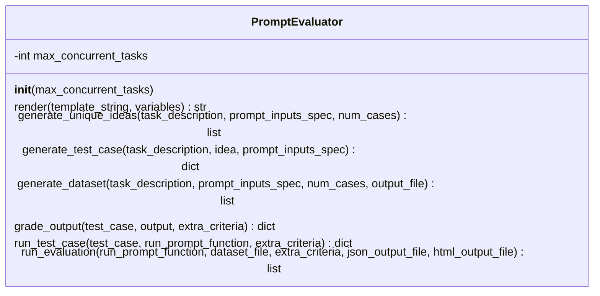
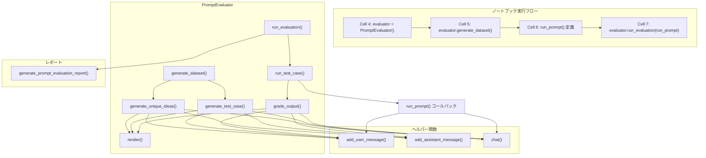
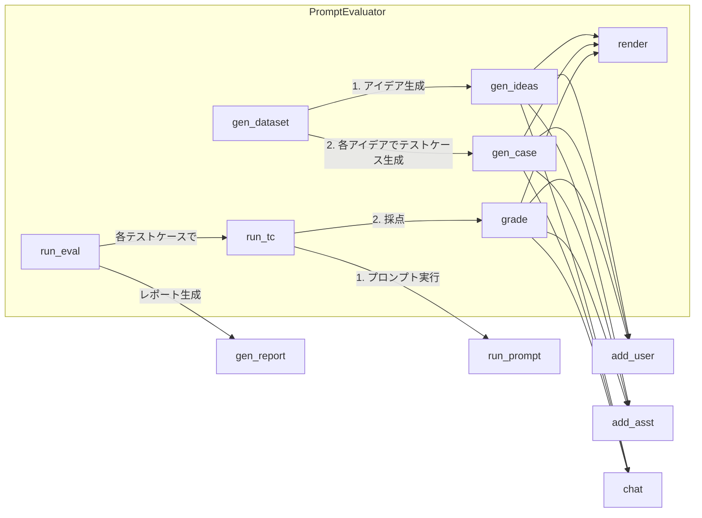
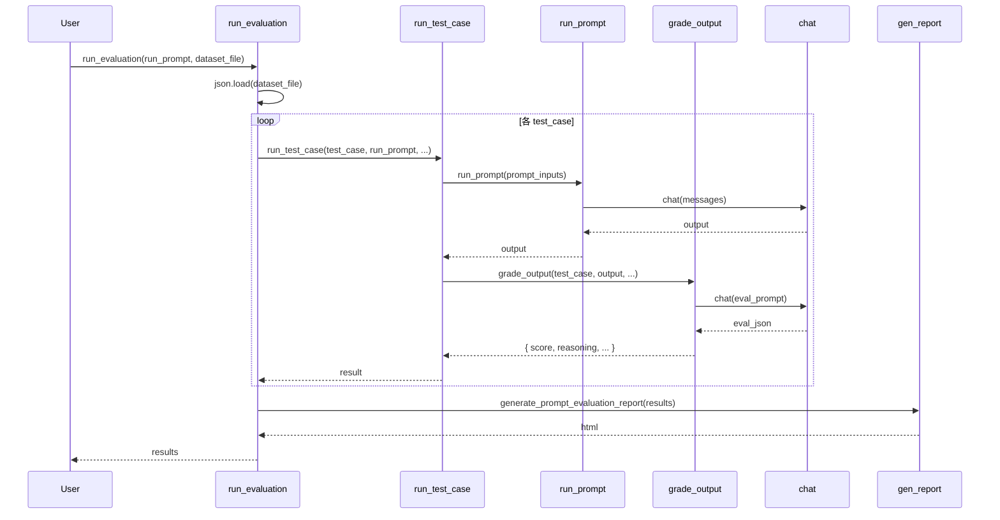

# 001_prompting.ipynb クラス・関数呼び出し関係

## 1. クラス図（PromptEvaluator）

## 2. 関数・モジュール一覧（クラス外）

| 名前 | 役割 |
|------|------|
| `add_user_message(messages, text)` | messages に user メッセージを追加 |
| `add_assistant_message(messages, text)` | messages に assistant メッセージを追加 |
| `chat(messages, system, temperature, stop_sequences)` | Anthropic API で会話しテキストを返す |
| `generate_prompt_evaluation_report(evaluation_results)` | 評価結果から HTML レポート文字列を生成 |

## 3. 呼び出し関係フロー図

## 4. メソッド別の内部呼び出し詳細

## 5. シーケンス図（評価実行時）

## 6. 依存関係サマリ

| 呼び出し元 | 呼び出し先 |
|------------|------------|
| `generate_dataset` | `generate_unique_ideas`, `generate_test_case` |
| `run_evaluation` | `run_test_case`, `generate_prompt_evaluation_report`, `mean` |
| `run_test_case` | `run_prompt`（引数）, `grade_output` |
| `generate_unique_ideas` | `render`, `add_user_message`, `add_assistant_message`, `chat` |
| `generate_test_case` | `render`, `add_user_message`, `add_assistant_message`, `chat` |
| `grade_output` | `render`, `add_user_message`, `add_assistant_message`, `chat` |
| `run_prompt`（ユーザー定義） | `add_user_message`, `chat` |

外部ライブラリ: `anthropic.Anthropic`, `json`, `re`, `textwrap.dedent`, `statistics.mean`, `concurrent.futures`, `dotenv.load_dotenv`
